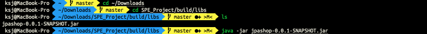
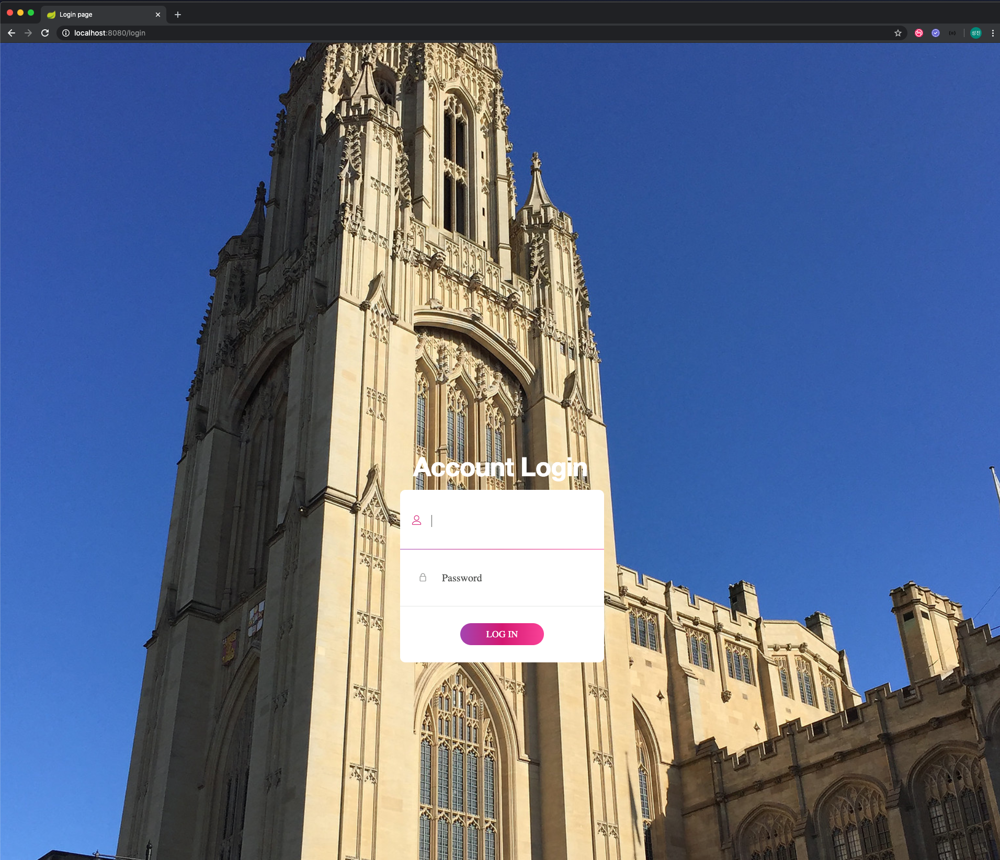
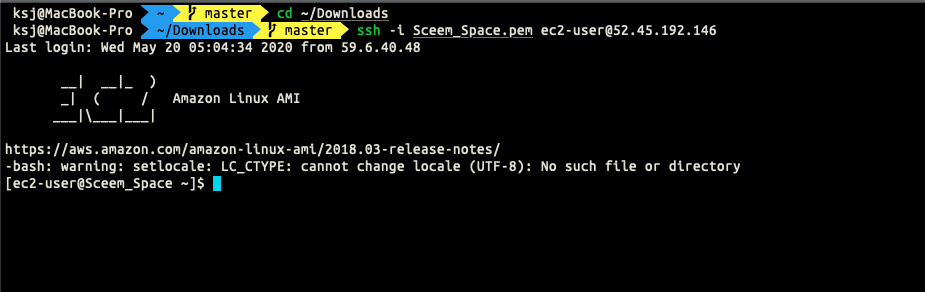
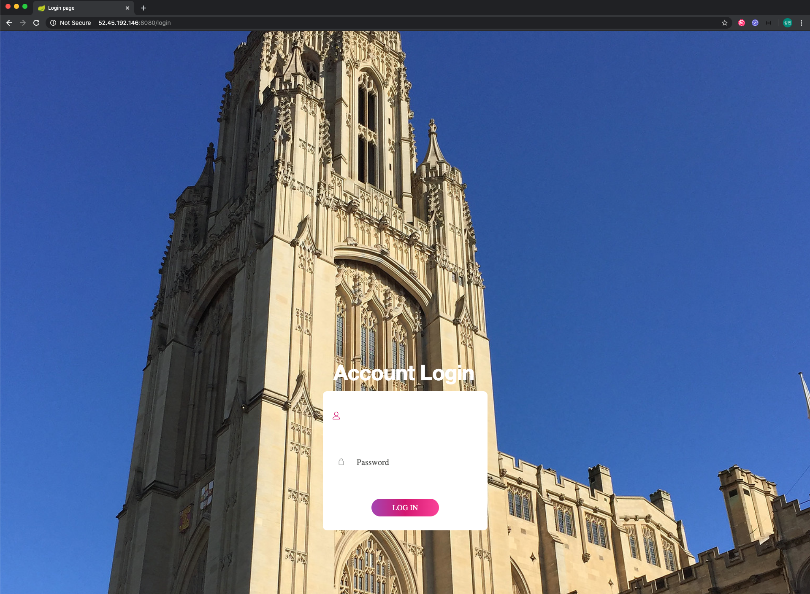

# SCEEM Space
### Software Product Engineering - Portfolio
##### Jason Park, Sungjin Kang, William Nafack, Calum West
----------------------------------------------------------

## Client Documentation

This document contains any information in regards to deploying the product, using the product, any technical developer documentation and any licensing documentation.

### Deployment instructions

This program is already deployed on the cloud, and in order to run it, you have to access AWS first. If more features were available on AWS we would have made this a continuous deployment. Therefore you must access the server and run the program.

In order to access the server, you must have the Sceem_Space.pem file and configure it appropriately. Configuring the file is really hard to explain on this document, so Sungjin Kang will set it up once the university has reopened.

There are two instructions below, the first one is before you have setup ssh (which means to run the program on local directory), and the second one is for when running the program on the server.

The below instructions assume that the downloaded file is in the ‘Downloads’ directory, and the OS is unix-based. For Windows, please download ‘Putty’ (This document only explains based on unix-based. For Windows, Sungjin Kang will install Putty and explain how to run it when set up). For the first approach, everyone should have the project folder (which has source code), java should be installed, and they should follow every step. However, for the second approach, as only one computer runs a program on server, then all the others can only access the webpage simply by accessing ‘http://52.45.192.146:8080/’.

* Running the program locally
  1. In order to run the program, you must first ensure Java is installed and also have downloaded the project folder.
  2. Open your terminal.
  3. Move to the directory the project folder is stored in (cd ~/folder).
  4. Run the command 'cd SPE_Project/build/libs/' which will take you to the appropriate folder within the project folder.
  5. Run the command 'ls', you should see 'jpashop-0-0-1.SNAPSHOT.jar'.
  6. Run the command 'java -jar jpashop-0-0-1.SNAPSHOT.jar'.

  

  7. You should then see 'Started JpashopApplication' in your terminal.
  8. Launch your web browser and access 'http://localhost:8080/login'.
  9. You are now on the login page and can use the system following the instructions.

  

* Running the program on AWS
  1. In order to access the system you must be accessing it from a University of Bristol IP address.
  2. Download the 'Sceem_Space.pem' file
  3. Open your terminal
  4. Move to the directory the 'Sceem_Space.pem' file is stored in (cd ~/folder).
  5. Run the command 'ssh -i Sceem_Space.pem ec2-user@52.45.192.146'.
  6. You should then see in your terminal, what is shown in one of the images below.

  

  7. Run the command './deploy.sh'.
  8. You should then see 'Started JpashopApplication' in your terminal.
  9. Launch your web browser and access 'http://52.45.192.146:8080/'.
  10. You are now on the login page and can use the system following the instructions.

  

Once the program is running on AWS, anyone is able to access the website. If the executing program is run on the server, no one will be able to access the web application until it is run again.

### Deploy script

```bash
#!/bin/bash

REPOSITORY=/home/ec2-user/deploy
PROJECT_NAME=SPE_Project

cd $REPOSITORY/$PROJECT_NAME/build/libs

echo "> Run Program"

java -jar jpashop-0.0.1-SNAPSHOT.jar
```

This script is used to simplify deploying the web application to AWS.

### License documentation

License documentation should already be in the possession of the school. Contracts to do with licensing and IP were signed at the start of the project.

### Using the product

This section should be read through once the web application is up and running and you are able to access it through the 'http://52.45.192.146:8080' address.

1. Managing remaining desks in a particular location
  - It is important to notice that staff need to change 'Remaining number of desks'
  - For example:
    + Assign 5 people in MVB.L0.410
    + Allocate 5 people in MVB.L0.410
    + Number of remaining seats in that location is now 0
    + If you need to allocate 2 more members in this location
    + Type '2' in 'Change remaining number of desks' field
2. How to make an account
  - Login with 'admin@bristol.ac.uk' and password '1234567890'
  - Click 'View all accounts' at the bottom of the webpage
  - Make you staff account and login with those details
3. How to delete a member
  - Navigate to 'Registered Members'
  - Click 'Modify' on member to be deleted
  - Change all values to 'None' or 'N/A'
  - Use this deleted member later to create a new member
4. How to delete a location
  - Navigate to 'Registered Locations'
  - Click 'Modify' on location to be deleted
  - Change all values to 'None' or 'N/A'
  - Use this deleted location later to create a new location

If you have any questions about the system please email: jp17528@bristol.ac.uk

For questions about the database/server please email: ou18496@bristol.ac.uk

### Technical developer documentation

1. Jinhyun Jason Park
  - Major product manager
  - Back-end developer/Spring frameworks and HTML
2. Sungjin Kang
  - Minor product manager
  - Back-end developer/Database and server security
3. William Nafack
  - Front-end developer/UI designer
4. Calum West
  - Group leader
