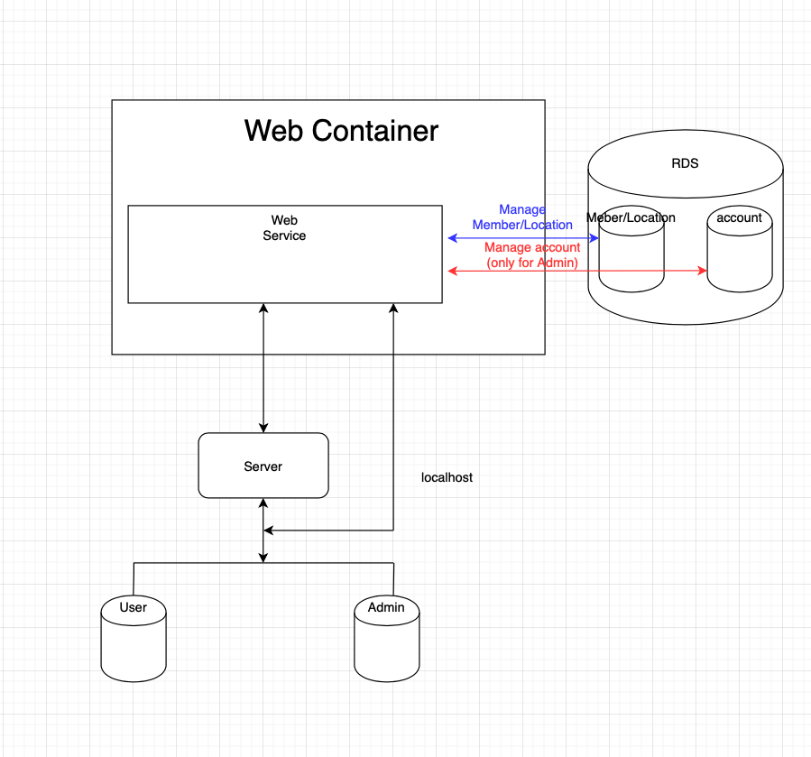
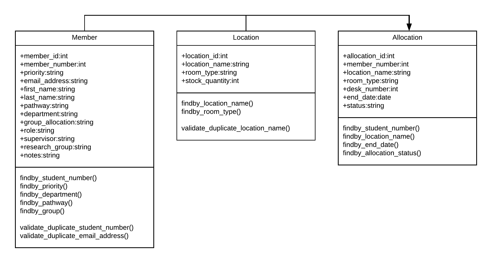

# SCEEM Space
### Software Product Engineering - Portfolio
##### Jason Park, Sungjin Kang, William Nafack, Calum West
----------------------------------------------------------

## OO Design and UML

### High-level Architecture

Our web application runs by using Apache Tomcat which offers an environment for running JSP and Java servlets. This application can run in two different ways; running on an EC2 instance (Amazon Linux AMI 1) on a server on AWS, or by being run locally. As mentioned in the deployment instructions for the application, in order to run the program on the server, a config file is required on the local PC. Before doing this, it is recommended that the program is run using the second method detailed in the deployment instructions.

We are using MariaDB database for making our RDS instances. This is where all of the data the client will be using is stored, and tables for the data are created. From a high level point of view, tables are divided into two parts. This is because only the admin user can access tables related to an account. This table is for making an account for a user who is then able to manage the data.

Whether the program is executed on a server or locally, they can access this RDS and can see the data on the RDS is being saved on EC2.

We have also used a Spring Boot framework. This is what the client will actually use and see on their own screens. Locally, they can access the web service and are able to do what they please. It is impossible to create a deploy script locally as we cannot determine which directory they will store the project in. However, we do have a deployment script for accessing the server, they can easily run the program by running the './deploy.sh' command in terminal.

This web service and RDS are actually stored on the server, but because of local access, the server and web service are divided.

The server itself is safe as only devices accessing with a University of Bristol IP address will be granted access.

For the front end of our system, we have used a mix of HTML, CSS and JavaScript so that we can display the information and data to our client in a clean and concise way, whilst keeping the web application looking nice and making it easy to navigate around the different pages.

### Static UML modelling

This UML diagram gives an overview of some of the static class aspects of our system.

Each rectangle contains variables that were used to describe their respective classes, Member, Location and Allocation. All of the 'findby' functions are specified in the Repository layer of member, location and allocation. JPA criteria property was used. Validation of duplication of the members and the locations is within the service layer.

A many to one / one to many table strategy was used in regards to the relationships between the tables.

'member_id' is the primary key of the member table, with 'location_id' being the primary key of the location table. 'member_number' and 'location_name' are foreign keys in the allocation table allowing a relationship between the three classes.

### Dynamic UML modelling

Both of these UML diagrams give an overview of two different aspects of our system, one being a login interaction diagram, outlining what happens between the user, server and database. The other, outlining the different actions that can be taken by a member of staff after logging into the system.

Our application utilises _PasswordEncoderFactories.createDelegatingPasswordEncoder_ to encode passwords before they are stored in the database. The account service layer saves the account details and stores them in the database.

Spring Web and Spring Security are used to validate the user when they attempt to log into the system.

_InMemoryUserDetailsManager_ was used to test the program before the 'account' database was developed. The in-memory login is now depreciated. _AccountAuthority_ was used to give different authorities to different types of users e.g staff, members. However, we are no longer using this since the client decided they only wanted staff to be able to access the system. This means that all users of the system are essentially given 'admin' privileges.

When staff log in they have three actions that they can then perform. They can register a member, register a location, or assign a member to a location. When the staff want to change the details of a member, they click 'Modify' and the member is re-registered. The same happens in the case of modifying a location. If a member of staff wants to modify the status of an allocation, they click 'Cancel' which deallocates the allocation and then they can reallocate.
