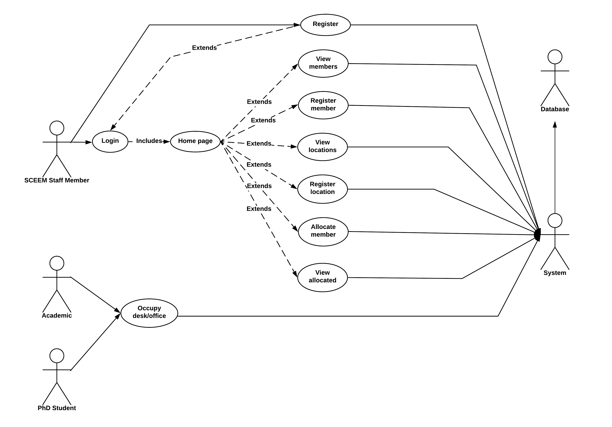

# SCEEM Space
### Software Product Engineering - Portfolio
##### Jason Park, Sungjin Kang, William Nafack, Calum West
----------------------------------------------------------

## Requirements

### Client requirements

Through meetings with our client, we were able to compile a list of their specific requirements for the system we were building. The main requirement for the system was that they wanted a dynamic website application instead of a static Excel spreadsheet. These are some of the other requirements outlined by the client.

* There needs to be three different kinds of members: Professor, Lecturer, PhD Student
* It should be possible to sort for each different type of member.
* It should be possible to designate a room type for each room in every location.
* It should be possible to sort by room type.
* It should be possible to find out how many people can be allocated to a specific location.
* There needs to be a login system.

From this list of requirements, we created a simple table comparing what our system would be able to do compared to what the previous spreadsheet was unable to accommodate.

| Developed Website Application                           | Excel Spreadsheet                                                 |
| ------------------------------------------------------- | ----------------------------------------------------------------- |
| Multiple staff can us the website at the same time      | Multiple access not possible                                      |
| Automatic calculation of remaining spaces in a location | Remaining spaces in a location have to be counted by hand         |
| Automatic detection of duplicated member ID's or emails | Manual detection of duplicated member ID's or emails              |
| Easy reallocation of members' locations                 | Difficult reallocation of members' locations                      |
| Automatically sorting members by priority               | Manual checking of members' priorities                            |
| Automatic sorting of allocations' expiry dates          | Manually removing allocations once expiry dates have been reached |

We were then able to identify both user and non-user stakeholders of our system and specific requirements relating to each stakeholder. This then allowed us to produce different flow steps for the system, as well as alternative and exceptional flow steps.

### Identified user stakeholders for SCEEM Space

_Staff members_ of ‘The School of Computer Science, Electrical and Electronic Engineering and Engineering Maths’. These staff members are admins that have access to the SCEEM Space application and can make changes, update information, add/remove people.

### User stakeholder stories

These are some different 'user stories'. They are things that the user (staff members) want to be able to do when they are using the product:

* Quick and easy way to add/remove locations as the school moves/expands  into different buildings.
* Quick and easy way to add/remove desks as more spaces become available to the school in different locations.
* Quick and easy way to add/remove members as people become members of the university, or leave the university.
* Manage sensitive information for academics and PhD students (names, emails, ID's, groups).
* Need to keep track of how many members are assigned to each location, therefore allowing a count of locations.
* Be able to keep track of the total number of locations, see how many are free and how many are allocated to a member.
* Be able to check member's previous locations.

### High level use case diagram

### Identified stakeholders for SCEEM Space

* _Academics (Professors/Lecturers)_ don’t have direct access to the database and other persons information contained within the database. They will not be able to see where other people are located office/desk wise. They are stakeholders as they are affected by the information input into the system by the staff members.
* _PhD students_ don’t have direct access to the database and other persons information contained within the database. They will not be able to see where other people are located office/desk wise. They are stakeholders as they are affected by the information input into the system by the staff members.
* _University students_ are not directly affected by the system but are still stakeholders. This system is used to assign spaces to academics and PhD students, and since university students often need to go to lecturers offices, the students are indirectly affected by where academics and PhD students are placed by the system. If an academic were to request to move office and this was accommodated by the system, then a university student would now have to go to a different place to speak to this academic.
* _Developers_ need to be able to keep the system up to date in the future and this should be made as easy as possible to do so. To ensure this happens, during development we have used frameworks, modules and libraries that are all well-documented.

### Flow steps for user stakeholder (staff member) stories

* Add location:
  - Navigate to application login page
  - Login to application using provided admin login details
  - Navigate to 'Register Location' tab
  - Enter details of location (name, room type, no. of desks)    
* Remove location:
  - Navigate to application login page
  - Login to application using provided admin login details
  - Navigate to ‘Registered Locations’ tab
  - Find location to be removed
  - Click on 'Modify' next to location
  - Change information in fields to 'None'  
* Change maximum capacity of location:
  - Navigate to application login page
  - Login to application using provided admin login details
  - Navigate to ‘Registered Locations’ tab
  - Find location in which the desk will be added
  - Click on ‘Modify' button
  - Change details of the location to add/remove a desk
* Add member:
  - Navigate to application login page
  - Login to application using provided admin login details
  - Navigate to ‘Register Member’ tab
  - Enter details of ‘member’ e.g Name, Email, Group, Pathway etc.
* Remove member:
  - Navigate to application login page
  - Login to application using provided admin login details
  - Navigate to ‘Registered Members' tab
  - Find member to remove
  - Click on 'Modify' button next to member
  - Change information in fields to 'None'
  - Change priority to 'Empty Member'
* Allocate member to location:
  - Navigate to application login page
  - Login to application using provided admin login details
  - Navigate to 'Allocate Member' tab
  - Select 'member' from drop-down list
  - Select 'location' from drop-down list
  - Enter other information (desk no., end date)
* Remove member from location:
  - Navigate to application login page
  - Login to application using provided admin login details
  - Navigate to 'Allocated Members/Locations' tab
  - Search for 'member' using search bar
  - Click 'Cancel' button
* Manage sensitive information:
  - Navigate to application login page
  - Login to application using provided admin login details
  - Navigate to ‘Registered Members’ tab
  - Search for ‘member’ using search bar
  - Click on ‘Modify'
  - Change any details that need to be added/removed
* Access total number of free desks/offices:
  - Navigate to application login page
  - Login to application using provided admin login details
  - Navigate to ‘Registered Locations’ tab
  - Look at number of desks left in each location under 'Left over desks'
* Check member's previous locations:
  - Navigate to application login page
  - Login to application using provided admin login details
  - Navigate to 'Allocated Members/Locations' tab
  - Sort allocation by 'DEALLOCATED'
  - Type the member's ID or location's name to see allocation history of a particular member or location

### Alternative flow steps

* Manage sensitive information:
  - Navigate to application login page
  - Login to application using provided admin login details
  - Navigate to 'Registered Members' tab
  - Click on 'Delete' button for 'member' you would like to change
  - Navigate back to home page
  - Navigate to 'Register Member' tab
  - Enter details of 'member' different to original details
* Access total number of free desks/offices:
  - Navigate to application login page
  - Login to application using provided admin login details
  - Navigate to 'Allocated members/locations' tab
  - Count number of members allocated to location
  - Subtract total number of allocated members from total number of locations

### Exceptional flow steps

Exceptional flows are shown in __bold__.

* Add location:
  - Navigate to application login page
  - Login to application using provided admin login details
  - __Navigate to incorrect tab__
  - Navigate to 'Register Location' tab
  - __Click on 'Submit' button__
  - __Enter incorrect details for space__
  - Enter correct details for space
  - Click on 'Submit' button

* Deletion of admin account:
  - __Account accidentally deleted by admin__
  - Navigate to application login page
  - Login to application with provided admin login details
  - Create new account with details of previous account

### Functional and non-functional requirements

* Functional requirements:
  - Member:
    + Sort by member number (ascending/descending)
    + Sort by priority of member
    + Sort by department of member
    + Sort by pathway of member
  - Location:
    + Sort by location name
    + Sort by room type
    + Show unoccupied desks in a particular location               
  - Allocated member/location:               
    + Search member by member number
    + Search location by location name
    + Sort by expiry date
    + Sort by allocation status (allocated, unallocated)
    + Allocation history should be available               
  - Account page:
    + Register account
    + Delete account

* Non-functional requirements:
  - Deleting a member:
    + Instead of deleting a member, modify all details as 'None' or 'N/A'
    + Use deleted member when registering new member if available
  - Deleting a location:
    + Instead of deleting a location, modify all details as 'None' or 'N/A'
    + Use deleted location when registering new location if available
  - Reallocation:
    + First remove, then allocate again

The non-functional requirements are necessary due to the relationships between the tables implemented in the system. When a member is allocated to a location, the software creates a new table that links the member table and the location table. When we remove a member from a location, the system tries to delete a row in the table which is not possible due to the parent child relationships in SQL tables. This means details are set to 'None' or NULL instead, allowing new allocations to happen.
